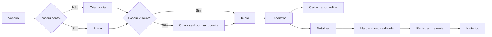
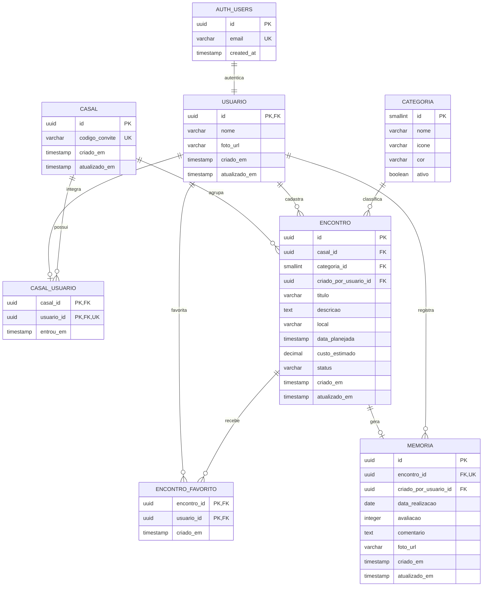

#  Nosso Rolê

> Momentos simples, histórias inesquecíveis.

## Sobre o app

O **Nosso Rolê** é um aplicativo móvel para casais organizarem ideias de encontros, planejarem os próximos programas e guardarem recordações dos momentos vividos juntos.

Cada pessoa terá sua própria conta. Depois de entrar no aplicativo, um dos usuários poderá criar o espaço do casal e compartilhar um código de convite com o parceiro ou a parceira. Assim, os dois terão acesso aos mesmos encontros, favoritos e memórias.

O aplicativo será desenvolvido em **React Native com Expo** e estará disponível para Android e iOS.

### Objetivo

Facilitar a escolha e a organização de programas a dois, reunindo planejamento e memórias em uma experiência simples, prática e afetiva.

### Funcionalidades prioritárias

A checklist será atualizada ao final de cada Checkpoint da disciplina.

- [ ] Criar uma conta de usuário;
- [ ] Entrar e sair da conta;
- [ ] Criar um espaço para o casal;
- [ ] Entrar em um casal por meio de um código de convite;
- [ ] Visualizar os encontros compartilhados pelo casal;
- [ ] Cadastrar um novo encontro;
- [ ] Editar e excluir um encontro;
- [ ] Informar categoria, data, horário, local e custo estimado;
- [ ] Classificar o encontro como ideia, planejado, realizado ou cancelado;
- [ ] Favoritar ideias de encontros;
- [ ] Pesquisar e filtrar encontros;
- [ ] Marcar um encontro como realizado;
- [ ] Avaliar e registrar um comentário sobre o encontro;
- [ ] Consultar o histórico de encontros realizados.

### Funcionalidades adicionais e trabalhos futuros

- [ ] Adicionar fotos às memórias;
- [ ] Sortear uma ideia de encontro;
- [ ] Enviar lembretes sobre encontros planejados;
- [ ] Integrar os locais dos encontros a um serviço de mapas;
- [ ] Adicionar o encontro ao calendário do dispositivo;
- [ ] Compartilhar os detalhes de um encontro por outros aplicativos;
- [ ] Exibir estatísticas, como categorias favoritas e quantidade de encontros realizados.

### Tecnologias previstas

- React Native;
- Expo;
- TypeScript;
- Expo Router;
- Supabase Authentication;
- Supabase Database (PostgreSQL);
- Jest e React Native Testing Library.

## Protótipos de tela

Os protótipos serão desenvolvidos no Figma e disponibilizados publicamente por meio do link abaixo:

🔗 [Visualizar o protótipo no Figma]([https://www.figma.com/design](https://www.figma.com/design/EIm3zxNkvF8huo7l2yL9VR/NOSSO-ROLE?node-id=0-1&t=LmccyKLjtw573PYC-1))

### 1. Acesso

Tela inicial de autenticação. Permite que o usuário entre com e-mail e senha ou acesse a opção de criação de conta.

### 2. Criar conta

Formulário com nome, e-mail, senha e confirmação de senha. Ao concluir o cadastro, o usuário será direcionado para a etapa de vínculo do casal.

### 3. Vínculo do casal

Permite criar um novo espaço para o casal ou entrar em um espaço existente utilizando um código de convite. O código gerado poderá ser enviado ao parceiro ou à parceira.

### 4. Início

Apresenta uma saudação, o próximo encontro planejado, atalhos para as principais ações, ideias favoritas e um pequeno resumo dos encontros realizados.

### 5. Encontros

Exibe todos os encontros compartilhados pelo casal em formato de cards. Possui campo de busca e filtros por categoria e status.

### 6. Cadastrar ou editar encontro

Formulário com os campos de título, descrição, categoria, data, horário, local, custo estimado, status e favorito. A mesma tela será reutilizada para edição.

### 7. Detalhes do encontro

Mostra todas as informações do encontro selecionado e oferece ações para editar, excluir, favoritar ou marcar como realizado.

### 8. Favoritos

Reúne as ideias marcadas como favoritas para ajudar o casal a escolher rapidamente o próximo programa.

### 9. Registrar memória

É apresentada quando um encontro é marcado como realizado. Permite informar a data de realização, atribuir uma nota de 1 a 5 e escrever um comentário sobre o momento.

### 10. Histórico

Exibe os encontros realizados em ordem cronológica, incluindo avaliação e comentário. Ao selecionar um item, o usuário poderá consultar seus detalhes.

### 11. Perfil

Apresenta os dados básicos do usuário e do casal, o código de convite e a opção de sair da conta.

### Fluxo principal

## Modelagem do banco de dados

O aplicativo utilizará um banco de dados **remoto e relacional**, implementado com **PostgreSQL por meio do Supabase**. A tabela `auth.users`, gerenciada pelo Supabase Authentication, armazenará as credenciais. Nenhuma senha será armazenada nas tabelas públicas da aplicação.

Cada registro de `auth.users` possuirá exatamente um registro correspondente em `usuario`, usado para os dados públicos do perfil. Todas as chaves estrangeiras de usuário apontarão para `usuario.id`, evitando referências sem uma tabela de destino explícita na modelagem da aplicação.

As tabelas seguem uma convenção única: nomes no singular, em português e em `snake_case`; chaves primárias chamadas `id`; chaves estrangeiras no formato `<entidade>_id`; e datas de auditoria com os sufixos `_em`.

As contas serão associadas a um casal pela tabela `casal_usuario`. Os encontros pertencerão ao casal e os favoritos serão armazenados em `encontro_favorito`, pois cada integrante pode favoritar uma ideia de maneira independente.

As políticas de segurança em nível de linha do Supabase, conhecidas como *Row Level Security* (RLS), permitirão que somente integrantes do casal consultem ou alterem os encontros e as memórias compartilhadas.

### Diagrama entidade-relacionamento

### Regras principais do banco

- `usuario.id` é simultaneamente chave primária e chave estrangeira de `auth.users.id`, formando uma relação de um para um;
- `casal_usuario` possui uma chave primária composta por `casal_id` e `usuario_id`;
- `casal_usuario.usuario_id` possui também uma restrição `UNIQUE`, pois um usuário participará de apenas um casal na primeira versão;
- O limite de dois integrantes por casal será garantido por uma função transacional no PostgreSQL;
- `casal.codigo_convite` deve ser único e gerado aleatoriamente;
- Todo encontro deve pertencer a um casal, a uma categoria e ao usuário que o cadastrou;
- `encontro.status` aceitará apenas `ideia`, `planejado`, `realizado` ou `cancelado`, usando uma restrição `CHECK`;
- `encontro.custo_estimado` deve ser maior ou igual a zero;
- `encontro_favorito` usa uma chave primária composta para impedir favoritos duplicados;
- `memoria.encontro_id` é único, garantindo no máximo uma memória para cada encontro;
- `memoria.avaliacao` deve possuir um valor entre 1 e 5;
- A exclusão de um casal removerá em cascata seus vínculos, encontros, favoritos e memórias;
- A exclusão de uma categoria em uso será bloqueada para preservar a integridade dos encontros;
- Serão criados índices para consultas por casal, status, data planejada, categoria e favoritos do usuário;
- As políticas RLS limitarão o acesso aos dados pertencentes ao casal do usuário autenticado.

## Planejamento de sprints

O desenvolvimento foi dividido em oito sprints de uma semana, totalizando uma previsão de **oito semanas**.

| Sprint | Duração | Requisitos e atividades | Resultado esperado |
|---|---:|---|---|
| 1 — Projeto e prototipação | 1 semana | Definir escopo, identidade visual, funcionalidades, fluxos, protótipos e modelagem do banco | README, protótipo público e diagrama concluídos |
| 2 — Estrutura do aplicativo | 1 semana | Criar o projeto Expo, configurar TypeScript, Expo Router, componentes básicos e tema visual | Aplicativo executando com navegação entre telas |
| 3 — Contas de usuário | 1 semana | Configurar Supabase, implementar cadastro, login, sessão e logout | Usuários conseguindo criar e acessar suas contas |
| 4 — Formação do casal | 1 semana | Criar o espaço do casal, gerar código de convite, entrar por código e aplicar regras de acesso | Duas contas vinculadas ao mesmo casal |
| 5 — Gestão de encontros | 1 semana | Implementar listagem, cadastro, detalhes, edição, exclusão e categorias | CRUD de encontros funcionando |
| 6 — Organização | 1 semana | Implementar busca, filtros, favoritos, status, data, local e custo estimado | Encontros organizados e fáceis de consultar |
| 7 — Memórias e histórico | 1 semana | Marcar encontros como realizados, registrar avaliação e comentário e montar histórico | Histórico compartilhado funcionando |
| 8 — Testes e entrega | 1 semana | Criar testes, validar formulários e regras, revisar acessibilidade, corrigir erros e gerar a versão final | Aplicativo revisado e pronto para apresentação |

### Estratégia de testes

- Testes unitários para validações e funções auxiliares;
- Testes de componentes para formulários, botões, filtros e cards;
- Testes de integração dos fluxos de cadastro, vínculo do casal e criação de encontros;
- Testes manuais em Android e iOS por meio do Expo Go;
- Verificação de mensagens de erro, estados vazios, carregamento e acessibilidade básica.
